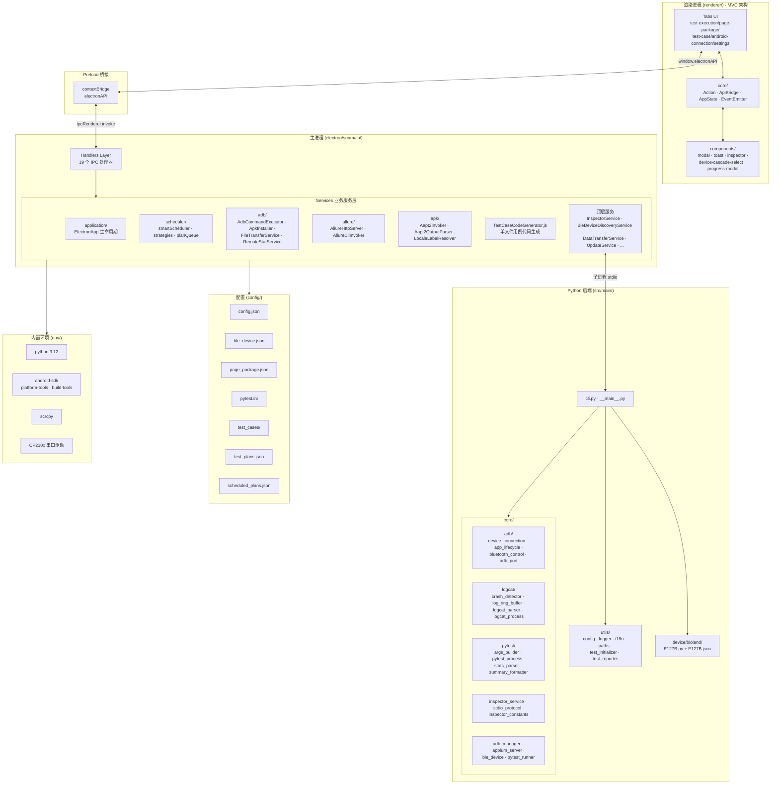
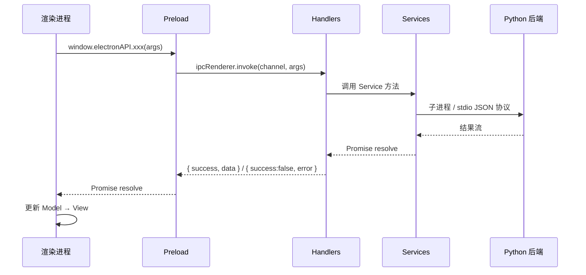

<div align="center">


# XKAutoTester

**基于 Electron + Python 的自动化测试平台**

[](LICENSE)
[](https://www.python.org)
[](https://www.electronjs.org)
[](https://vitejs.dev)
[](https://github.com/RingOnTheWay/XKAutoTester)
[](https://www.microsoft.com/windows)

**简体中文 | [English](docs/README_EN.md)**

⭐ 如果您喜欢这个项目，不妨在 GitHub 上点个 Star — 非常感谢！

[功能特性](#功能特性) • [架构概览](#架构概览) • [快速开始](#快速开始) • [环境要求](#环境要求) • [安装](#安装) • [使用指南](#使用指南)

</div>

***

## 概述

XKAutoTester 是一个功能强大的自动化测试平台，结合了 Electron 的跨平台桌面应用能力和 Python 的自动化测试生态，目前只维护 Windows 平台下软件的执行环境。该平台支持 Android 设备的自动化测试，提供测试用例管理、页面元素封装、蓝牙设备模拟、测试计划管理、定时执行、报告生成、元素检查器等完整功能。

## 功能特性

### 测试管理

- **测试用例管理** — 可视化创建、编辑测试用例，支持安卓用例模板化 Python 代码生成（`TestCaseCodeGenerator` + Jinja 模板）
- **页面元素封装** — 应用-页面-元素三级管理，APK 包信息自动识别（`aapt2` 调用 + 多语言标签解析），元素定位器统一维护
- **测试计划管理** — 创建、编辑、删除测试计划，支持测试文件选择和测试类型筛选
- **定时执行** — 基于 `node-cron` 的最小堆优先队列调度器，支持 cron 表达式与一次性执行
- **循环执行** — 支持循环运行测试，可配置失败后是否继续
- **Allure 报告** — 自动生成专业的测试报告，支持历史记录查看与钉钉通知推送
- **元素检查器** — 集成 Appium Inspector（`InspectorService` + `JsonStdioTransport` + Python `stdio_protocol`），实时检查 UI 元素定位器

### 设备与连接

- **Android 设备管理** — ADB 连接管理（`ADBService` + `AdbCommandExecutor` + `AdbPathQuoter`），支持 USB 和无线连接
- **蓝牙设备模拟** — BLE 设备 Mock 管理（`BleDeviceDiscoveryService` + `SerialPortEnumerator`），支持串口通信与数据模拟
- **屏幕控制** — 集成 Scrcpy（`ScrcpyService`），实时查看和控制设备屏幕
- **文件管理** — 浏览和管理安卓设备文件系统（`DataTransferService` + `FileTransferService` + `RemoteStatService`），支持 APK 一键安装（`ApkInstaller` + `AdbProgressMonitor`）

### 平台能力

- **多语言支持** — 支持中文和英文界面语言（`I18nService` + i18next）
- **暗色模式** — 支持亮色/暗色主题切换
- **通知推送** — 支持钉钉平台的通知推送（`NotificationService` + HMAC-SHA256 签名）
- **自动更新** — 支持应用版本检查与自动更新（`UpdateService` + GitHub Releases API）
- **配置迁移** — 用户配置跨版本自动迁移与同步（`UserDataService` + `UserDataMigrator` + `WindowsRegistryBridge`）
- **防系统休眠** — 测试执行期间可禁止系统睡眠（`powerSaveBlocker`）
- **驱动检测** — 串口/USB 驱动可用性检查（`DriverChecker`）
- **环境启动编排** — 启动期环境检查与 JDK/SDK/Python 检测（`EnvironmentService` + `EnvironmentStartupService`）

## 技术架构

|  组件  |              技术栈             |
| :--: | :--------------------------: |
| 桌面应用 | Electron 43 + 原生 HTML/CSS/JS + Vite 5 / electron-vite |
| 渲染层架构 | MVC（Controller / Model / View / Mixin）|
| 测试框架 |        Pytest + Allure       |
| 移动测试 |     Appium + UiAutomator2    |
| 设备控制 |         ADB + Scrcpy         |
| 蓝牙模拟 |     PySerial + MB026A 模块     |
| 代码生成 |          Jinja 模板引擎          |
|  包管理 |  uv (Python) + npm (Node.js) |
|  图标  |         Lucide Icons         |
|  国际化 |            i18next           |
|  打包  |    electron-builder (NSIS)   |

## 架构概览



### IPC 通信流



## 环境要求

| 工具                         |  版本要求  | 说明            |
| :------------------------- | :----: | :------------ |
| Python                     | 3.10+（内置 3.12） | 测试执行核心        |
| Node.js                    |   22+  | Electron 运行环境 |
| JDK                        |   17+  | Allure 报告生成依赖 |
| Allure                     | 2.x（内置 npm allure 3.9） | 测试报告生成        |
| Android SDK Platform-tools |   36   | ADB 工具        |
| Android SDK Build-tools    | 29.0.3 | aapt2 工具      |
| Scrcpy                     |  3.3.3 | 设备屏幕镜像控制      |

> \[!NOTE]
> 安装包已内置 Python 3.12、Android SDK、Scrcpy、CP210x 串口驱动，无需手动配置。开发模式下需自行安装 JDK 与 Node.js。

## 安装

### 1. 克隆项目

```bash
git clone https://github.com/RingOnTheWay/XKAutoTester.git
cd XKAutoTester
```

### 2. 安装 Python 依赖

使用 [uv](https://github.com/astral-sh/uv) 进行依赖管理：

```bash
# 安装 uv（如果尚未安装）
pip install uv

# 同步依赖
uv sync
```

> `pyproject.toml` 中 `requires-python = ">=3.10"`，建议使用 Python 3.12。

### 3. 安装 Electron 依赖

```bash
cd electron
npm install
```

> `postinstall` 钩子会自动执行 `patch-nsis.js` 修补 NSIS 构建配置。

### 4. 开发模式额外准备

下载并配置 Allure、JDK 17+、Android SDK、Scrcpy 到环境变量中（安装包已内置，开发模式需手动配置）。

## 快速开始

### 开发模式运行

```bash
# 在项目根目录
cd electron

# 方式 A：Vite 开发模式（推荐，HMR 热更新）
npm run dev

# 方式 B：传统 Electron 直启（兼容旧流程）
npm start
# 或
npm run dev:legacy
```

应用将首先显示启动画面（splash screen），`EnvironmentStartupService` 完成环境检查后进入主界面。

### 构建生产版本

```bash
cd electron

# 完整安装包（含 .venv + env/ 内置环境）
npm run build-win

# 精简安装包（不含内置 Python/SDK/Scrcpy，需用户自行配置）
npm run build-lite-win
```

构建完成后，安装包将生成在 `electron/dist` 目录。

### Vite 构建（仅产物，不打包）

```bash
cd electron
npm run build:vite
```

## 使用指南

完整的操作指南请参阅以下教程：

| 编号 | 教程 | 内容 |
|:--:|------|------|
| 01 | [安装与环境配置](docs/tutorials/zh-CN/01-installation.md) | 开发环境搭建、依赖安装、首次启动、Vite 模式 |
| 02 | [测试用例管理](docs/tutorials/zh-CN/02-test-case.md) | 用例创建、步骤配置、代码生成、蓝牙 Mock |
| 03 | [页面元素封装](docs/tutorials/zh-CN/03-page-package.md) | 应用-页面-元素三级管理、APK 自动解析、Inspector 元素检查 |
| 04 | [测试执行与报告](docs/tutorials/zh-CN/04-test-execution.md) | 计划管理、测试运行、Allure 报告查看、循环执行 |
| 05 | [设备连接与投屏](docs/tutorials/zh-CN/05-device-connection.md) | 设备连接、Scrcpy 投屏、文件管理、APK 安装、蓝牙设备发现 |
| 06 | [定时计划与循环执行](docs/tutorials/zh-CN/06-scheduled-plan.md) | cron 定时触发、循环执行、失败处理策略、智能调度 |
| 07 | [系统设置](docs/tutorials/zh-CN/07-settings.md) | 语言/主题/通知/数据路径/版本更新/防休眠 |

> English guides are available at [docs/tutorials/en-US/](docs/tutorials/en-US/)

## 项目结构

```
XKAutoTester/
├── electron/                       # Electron 前端
│   ├── src/
│   │   ├── main/                   # 主进程
│   │   │   ├── handlers/           # IPC 处理器（19 个 + base/handlerUtils）
│   │   │   │   ├── base/           # IPC 注册工具
│   │   │   │   ├── adbHandlers.js
│   │   │   │   ├── apkHandlers.js
│   │   │   │   ├── bleDeviceDiscoveryHandlers.js  # 新增：蓝牙设备发现
│   │   │   │   ├── configHandlers.js
│   │   │   │   ├── dataTransferHandlers.js        # 新增：文件传输
│   │   │   │   ├── deviceHandlers.js
│   │   │   │   ├── environmentHandlers.js
│   │   │   │   ├── fileHandlers.js
│   │   │   │   ├── inspectorHandlers.js           # 新增：元素检查器
│   │   │   │   ├── pagePackageHandlers.js
│   │   │   │   ├── powerHandlers.js
│   │   │   │   ├── reportHandlers.js
│   │   │   │   ├── scheduledPlanHandlers.js
│   │   │   │   ├── testCaseHandlers.js
│   │   │   │   ├── testPlanHandlers.js
│   │   │   │   ├── updateHandlers.js
│   │   │   │   ├── versionHandlers.js
│   │   │   │   └── windowHandlers.js
│   │   │   ├── services/           # 业务服务层
│   │   │   │   ├── adb/            # ADB 子模块（命令执行/APK安装/文件传输/远程stat）
│   │   │   │   ├── allure/         # Allure 子模块（HTTP服务/Cli调用）
│   │   │   │   ├── apk/            # APK 解析子模块（aapt2/输出解析/多语言标签）
│   │   │   │   ├── application/    # ElectronApp 生命周期（factories/effects/index）
│   │   │   │   ├── base/           # JsonFileCrudService 基类
│   │   │   │   ├── scheduler/      # 调度器子模块（planQueue/smartScheduler/strategies）
│   │   │   │   ├── ADBService.js
│   │   │   │   ├── AdbProgressMonitor.js     # ADB 进度监控
│   │   │   │   ├── AllureService.js
│   │   │   │   ├── ApkParserService.js
│   │   │   │   ├── BleDeviceDiscoveryService.js  # 蓝牙设备发现
│   │   │   │   ├── DataTransferService.js        # 文件传输
│   │   │   │   ├── DriverChecker.js              # 驱动检测
│   │   │   │   ├── EnvironmentService.js
│   │   │   │   ├── EnvironmentStartupService.js  # 环境启动编排
│   │   │   │   ├── FileBasedDialogMonitor.js
│   │   │   │   ├── I18nService.js
│   │   │   │   ├── InspectorService.js           # Appium Inspector 集成
│   │   │   │   ├── JsonStdioTransport.js         # stdio JSON 协议传输
│   │   │   │   ├── NotificationService.js
│   │   │   │   ├── PagePackageService.js
│   │   │   │   ├── PythonTestService.js
│   │   │   │   ├── ScheduledPlanService.js
│   │   │   │   ├── ScrcpyService.js
│   │   │   │   ├── SerialPortEnumerator.js       # 串口枚举
│   │   │   │   ├── TarExtractor.js               # tar 解压
│   │   │   │   ├── TestCaseCodeGenerator.js      # 用例代码生成（从 TestCaseService 拆出）
│   │   │   │   ├── TestCaseService.js
│   │   │   │   ├── TestPlanService.js
│   │   │   │   ├── UpdateService.js
│   │   │   │   ├── UserDataMigrator.js           # 用户数据迁移（从 UserDataService 拆出）
│   │   │   │   ├── UserDataService.js
│   │   │   │   ├── VersionService.js
│   │   │   │   ├── WindowsRegistryBridge.js      # Windows 注册表桥接
│   │   │   │   └── spawnHelper.js
│   │   │   ├── utils/
│   │   │   │   ├── asyncFs.js
│   │   │   │   ├── logger.js                     # 新增：日志工具
│   │   │   │   └── pathHelper.js
│   │   │   ├── ElectronApp.js
│   │   │   └── index.js
│   │   ├── preload/
│   │   │   └── index.js             # Preload 桥接（contextBridge）
│   │   └── shared/
│   │       └── constants.js          # IPC 通道常量
│   ├── renderer/                    # 渲染进程（MVC 架构）
│   │   ├── core/                    # 核心基类（Action/ApiBridge/AppState/EventEmitter）
│   │   ├── tabs/                    # 5 个 Tab（MVC 拆分）
│   │   │   ├── android-connection/
│   │   │   ├── page-package/
│   │   │   ├── settings/
│   │   │   ├── test-case/           # 含 modules/（4 个领域深模块）
│   │   │   └── test-execution/
│   │   ├── components/              # UI 组件
│   │   │   ├── mixins/              # 组件 Mixin（11 个）
│   │   │   ├── inspector.js         # Appium Inspector 弹窗
│   │   │   ├── device-selection-modal.js
│   │   │   ├── device-cascade-select.js
│   │   │   ├── datetime-picker.js
│   │   │   ├── progress-modal.js
│   │   │   ├── modal.js · toast.js · progress-indicator.js
│   │   │   └── *.html
│   │   ├── styles/                  # 15 个 CSS 模块（@import 架构）
│   │   ├── app.js                   # 应用入口
│   │   ├── icons.js                 # Lucide 图标定义
│   │   ├── index.html
│   │   └── styles.css               # @import 入口
│   ├── assets/                      # 静态资源（icon/字体/NSIS 侧边栏）
│   ├── locales/                     # i18n 翻译（zh-CN/en-US）
│   ├── templates/
│   │   └── test_case_template.py    # Jinja 测试用例模板
│   ├── build/
│   │   └── installer.nsh            # NSIS 自定义脚本
│   ├── splash.html                  # 启动画面
│   ├── patch-nsis.js                # NSIS 构建补丁
│   └── package.json
├── src/main/                        # Python 后端
│   ├── core/                        # 核心模块
│   │   ├── adb/                     # ADB 子模块（端口/生命周期/蓝牙控制/连接/适配器）
│   │   ├── logcat/                  # Logcat 子模块（崩溃检测/环形缓冲/解析/进程）
│   │   ├── pytest/                  # Pytest 子模块（参数构建/路径解析/进程/统计/格式化）
│   │   ├── adb_manager.py
│   │   ├── appium_server.py
│   │   ├── ble_device.py            # BLE 蓝牙设备模拟
│   │   ├── crash_monitor.py         # 崩溃监控
│   │   ├── inspector_constants.py   # Inspector 常量
│   │   ├── inspector_service.py     # Appium Inspector 服务
│   │   ├── logcat_monitor.py        # Logcat 监控
│   │   ├── pytest_runner.py         # Pytest 运行器
│   │   └── stdio_protocol.py        # stdio JSON 协议
│   ├── device/
│   │   └── bioland/
│   │       ├── E127B.json           # 体温计数据配置（外置）
│   │       └── E127B.py             # Bioland 体温计 16 进制数据生成
│   ├── recognition/
│   │   └── captcha_recognizer.py    # 验证码 OCR（ddddocr）
│   ├── utils/
│   │   ├── config.py
│   │   ├── i18n.py                  # 国际化（新增）
│   │   ├── logger.py
│   │   ├── paths.py                 # 路径抽象（新增）
│   │   ├── test_initializer.py
│   │   ├── test_reporter.py
│   │   └── text.py
│   ├── cli.py                       # CLI 入口（从 __main__.py 拆出）
│   └── __main__.py                  # Electron 集成入口
├── config/                          # 配置文件目录
│   ├── config.json                  # 应用配置（单源权威）
│   ├── ble_device.json              # 蓝牙设备配置
│   ├── page_package.json            # 页面封装配置
│   ├── pytest.ini                   # Pytest 配置
│   ├── test_cases/                  # 测试用例 JSON（运行时创建）
│   ├── test_plans.json              # 测试计划（运行时创建）
│   └── scheduled_plans.json         # 定时计划（运行时创建）
├── env/                             # 内置环境（随安装包分发，开发模式可放置）
│   ├── python/                      # 内置 Python 3.12
│   ├── android-sdk/                 # platform-tools + build-tools
│   ├── scrcpy/                      # 投屏工具
│   └── CP210x_Windows_Drivers/      # 串口驱动
├── scripts/
│   └── sync_version.py              # 版本同步脚本
├── refactor-rfcs/                   # 重构 RFC 文档（30+ 篇）
├── docs/                            # 文档
│   ├── tutorials/zh-CN/             # 中文教程（7 篇）
│   ├── tutorials/en-US/             # 英文教程（7 篇）
│   └── README_EN.md
├── version.json                     # 版本信息（version/buildDate/prerelease/fullVersion）
├── pyproject.toml                   # Python 项目配置
└── uv.lock                          # Python 依赖锁定
```

## 资源

- [Pytest 官方文档](https://docs.pytest.org/)
- [Allure 报告文档](https://docs.qameta.io/allure/)
- [Appium 官方文档](https://appium.io/)
- [Electron 官方文档](https://www.electronjs.org/docs)
- [Vite 官方文档](https://vitejs.dev)
- [Scrcpy 项目](https://github.com/Genymobile/scrcpy)
- [Lucide 图标库](https://lucide.dev/)
- [Temurin17 项目](https://github.com/adoptium/temurin17-binaries)
- [uv 包管理器](https://github.com/astral-sh/uv)

## 许可证

本项目采用 [MIT](LICENSE) 许可证开源。
