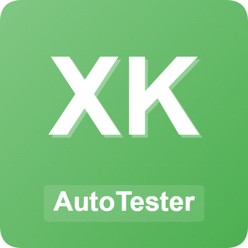
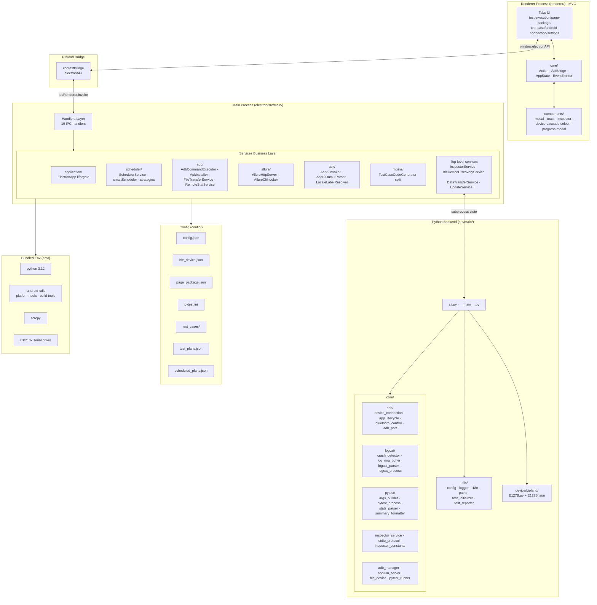
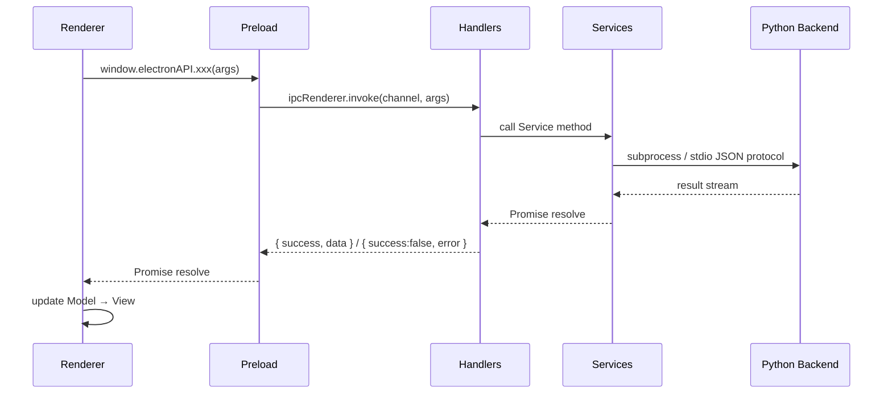

<div align="center">



# XKAutoTester

**Automation Testing Platform Based on Electron + Python**

[](LICENSE)
[](https://www.python.org)
[](https://www.electronjs.org)
[](https://vitejs.dev)
[](https://github.com/RingOnTheWay/XKAutoTester)
[](https://www.microsoft.com/windows)

**[简体中文](../README.md) | English**

⭐ If you like this project, please give it a Star on GitHub — Thank you!

[Features](#features) • [Architecture Overview](#architecture-overview) • [Quick Start](#quick-start) • [Requirements](#requirements) • [Installation](#installation) • [Usage Guide](#usage-guide)

</div>

***

## Overview

XKAutoTester is a powerful automation testing platform that combines Electron's cross-platform desktop application capabilities with Python's automation testing ecosystem. Currently, only the Windows platform execution environment is maintained. The platform supports automated testing for Android devices, providing complete functionality including test case management, page element encapsulation, Bluetooth device simulation, test plan management, scheduled execution, report generation, and an element inspector.

## Features

### Test Management

- **Test Case Management** — Visually create and edit test cases, support Android case templated Python code generation (`TestCaseCodeGenerator` + Jinja template)
- **Page Element Encapsulation** — App-Page-Element three-level management, APK package info auto-recognition (`aapt2` invocation + multi-language label resolution), element locator unified maintenance
- **Test Plan Management** — Create, edit, delete test plans, support test file selection and test type filtering
- **Scheduled Execution** — Min-heap priority queue scheduler based on `node-cron`, supports cron expressions and one-shot execution
- **Loop Execution** — Support loop running tests, configurable whether to continue after failure
- **Allure Reports** — Automatically generate professional test reports, support history viewing and DingTalk notification push
- **Element Inspector** — Integrated Appium Inspector (`InspectorService` + `JsonStdioTransport` + Python `stdio_protocol`), real-time UI element locator inspection

### Device & Connection

- **Android Device Management** — ADB connection management (`ADBService` + `AdbCommandExecutor` + `AdbPathQuoter`), support USB and wireless connection
- **Bluetooth Device Simulation** — BLE device Mock management (`BleDeviceDiscoveryService` + `SerialPortEnumerator`), support serial communication and data simulation
- **Screen Control** — Integrated Scrcpy (`ScrcpyService`), real-time view and control device screen
- **File Management** — Browse and manage Android device file system (`DataTransferService` + `FileTransferService` + `RemoteStatService`), support one-click APK installation (`ApkInstaller` + `AdbProgressMonitor`)

### Platform Capabilities

- **Multi-language Support** — Support Chinese and English interface languages (`I18nService` + i18next)
- **Dark Mode** — Support light/dark theme switching
- **Notification Push** — Support DingTalk platform notification push (`NotificationService` + HMAC-SHA256 signature)
- **Auto Update** — Support application version check and auto update (`UpdateService` + GitHub Releases API)
- **Config Migration** — User config cross-version auto migration and sync (`UserDataService` + `UserDataMigrator` + `WindowsRegistryBridge`)
- **Prevent System Sleep** — Can prevent system sleep during test execution (`powerSaveBlocker`)
- **Driver Check** — Serial/USB driver availability check (`DriverChecker`)
- **Environment Startup Orchestration** — Startup environment check and JDK/SDK/Python detection (`EnvironmentService` + `EnvironmentStartupService`)

## Tech Stack

|  Component  |              Technology             |
| :--------- | :-------------------------------: |
| Desktop App | Electron 38 + Native HTML/CSS/JS + Vite 5 / electron-vite |
| Renderer Architecture | MVC (Controller / Model / View / Mixin) |
| Test Framework |        Pytest + Allure           |
| Mobile Testing |     Appium + UiAutomator2        |
| Device Control |         ADB + Scrcpy             |
| Bluetooth Simulation |     PySerial + MB026A Module     |
| Code Generation |          Jinja Template Engine    |
| Package Manager |  uv (Python) + npm (Node.js)     |
| Icons       |         Lucide Icons             |
| i18n        |            i18next               |
| Packaging   |    electron-builder (NSIS)       |

## Architecture Overview



### IPC Communication Flow



## Requirements

| Tool                      | Version  | Description               |
| :------------------------ | :------: | :----------------------- |
| Python                    | 3.10+ (bundled 3.12) | Test execution core       |
| Node.js                   |   22+    | Electron runtime          |
| JDK                       |   17+    | Allure report dependency  |
| Allure                    | 2.x (bundled npm allure 3.9) | Test report generation    |
| Android SDK Platform-tools |    36    | ADB tool                  |
| Android SDK Build-tools   |  29.0.3  | aapt2 tool                |
| Scrcpy                    |   3.3.3  | Device screen mirroring   |

> \[!NOTE]
> The installer bundles Python 3.12, Android SDK, Scrcpy, and CP210x serial driver. No manual configuration needed. For development mode, install JDK and Node.js manually.

## Installation

### 1. Clone the Project

```bash
git clone https://github.com/RingOnTheWay/XKAutoTester.git
cd XKAutoTester
```

### 2. Install Python Dependencies

Use [uv](https://github.com/astral-sh/uv) for dependency management:

```bash
# Install uv (if not already installed)
pip install uv

# Sync dependencies
uv sync
```

> `pyproject.toml` specifies `requires-python = ">=3.10"`. Python 3.12 is recommended.

### 3. Install Electron Dependencies

```bash
cd electron
npm install
```

> The `postinstall` hook automatically runs `patch-nsis.js` to patch NSIS build config.

### 4. Development Mode Extras

Download and configure Allure, JDK 17+, Android SDK, Scrcpy to environment variables (bundled in installer; dev mode requires manual setup).

## Quick Start

### Run in Development Mode

```bash
# In project root directory
cd electron

# Option A: Vite dev mode (recommended, HMR hot reload)
npm run dev

# Option B: Legacy Electron direct start (compat with old flow)
npm start
# or
npm run dev:legacy
```

The app will first show a splash screen, and `EnvironmentStartupService` will complete environment checks before entering the main UI.

### Build Production Version

```bash
cd electron

# Full installer (includes .venv + env/ bundled tools)
npm run build-win

# Lite installer (no bundled Python/SDK/Scrcpy; user must configure)
npm run build-lite-win
```

After build completes, the installer will be generated in `electron/dist` directory.

### Vite Build (output only, no packaging)

```bash
cd electron
npm run build:vite
```

## Usage Guide

For complete operating instructions, please refer to the following tutorials:

| No. | Tutorial | Content |
|:--:|------|------|
| 01 | [Installation & Environment Setup](tutorials/en-US/01-installation.md) | Dev environment setup, dependency installation, first launch, Vite mode |
| 02 | [Test Case Management](tutorials/en-US/02-test-case.md) | Case creation, step configuration, code generation, BLE Mock |
| 03 | [Page Element Packaging](tutorials/en-US/03-page-package.md) | App-Page-Element management, APK auto-parsing, Inspector element check |
| 04 | [Test Execution & Reports](tutorials/en-US/04-test-execution.md) | Plan management, test running, Allure report viewing, loop execution |
| 05 | [Device Connection & Mirroring](tutorials/en-US/05-device-connection.md) | Device connection, Scrcpy mirroring, file management, APK install, BLE discovery |
| 06 | [Scheduled Plans & Loop Execution](tutorials/en-US/06-scheduled-plan.md) | cron scheduled triggers, loop execution, failure handling, smart scheduling |
| 07 | [System Settings](tutorials/en-US/07-settings.md) | Language/theme/notifications/data path/updates/sleep prevention |

> 中文指南请参阅 [tutorials/zh-CN/](tutorials/zh-CN/)

## Project Structure

```
XKAutoTester/
├── electron/                       # Electron frontend
│   ├── src/
│   │   ├── main/                   # Main process
│   │   │   ├── handlers/           # IPC handlers (19 + base/handlerUtils)
│   │   │   │   ├── base/           # IPC registration utils
│   │   │   │   ├── adbHandlers.js
│   │   │   │   ├── apkHandlers.js
│   │   │   │   ├── bleDeviceDiscoveryHandlers.js  # NEW: BLE device discovery
│   │   │   │   ├── configHandlers.js
│   │   │   │   ├── dataTransferHandlers.js        # NEW: file transfer
│   │   │   │   ├── deviceHandlers.js
│   │   │   │   ├── environmentHandlers.js
│   │   │   │   ├── fileHandlers.js
│   │   │   │   ├── inspectorHandlers.js           # NEW: element inspector
│   │   │   │   ├── pagePackageHandlers.js
│   │   │   │   ├── powerHandlers.js
│   │   │   │   ├── reportHandlers.js
│   │   │   │   ├── scheduledPlanHandlers.js
│   │   │   │   ├── testCaseHandlers.js
│   │   │   │   ├── testPlanHandlers.js
│   │   │   │   ├── updateHandlers.js
│   │   │   │   ├── versionHandlers.js
│   │   │   │   └── windowHandlers.js
│   │   │   ├── services/           # Business service layer
│   │   │   │   ├── adb/            # ADB submodules (cmd exec/APK install/file transfer/remote stat)
│   │   │   │   ├── allure/         # Allure submodules (HTTP server/Cli invoke)
│   │   │   │   ├── apk/            # APK parsing submodules (aapt2/output parse/locale labels)
│   │   │   │   ├── application/    # ElectronApp lifecycle (factories/effects/index)
│   │   │   │   ├── base/           # JsonFileCrudService base
│   │   │   │   ├── mixins/         # TestCaseCodeGenerator Mixins (5)
│   │   │   │   ├── scheduler/      # Scheduler submodules (planQueue/smartScheduler/strategies)
│   │   │   │   ├── ADBService.js
│   │   │   │   ├── AdbProgressMonitor.js     # ADB progress monitor
│   │   │   │   ├── AllureService.js
│   │   │   │   ├── ApkParserService.js
│   │   │   │   ├── BleDeviceDiscoveryService.js  # BLE device discovery
│   │   │   │   ├── DataTransferService.js        # File transfer
│   │   │   │   ├── DriverChecker.js              # Driver check
│   │   │   │   ├── EnvironmentService.js
│   │   │   │   ├── EnvironmentStartupService.js  # Environment startup orchestration
│   │   │   │   ├── FileBasedDialogMonitor.js
│   │   │   │   ├── I18nService.js
│   │   │   │   ├── InspectorService.js           # Appium Inspector integration
│   │   │   │   ├── JsonStdioTransport.js         # stdio JSON protocol transport
│   │   │   │   ├── NotificationService.js
│   │   │   │   ├── PagePackageService.js
│   │   │   │   ├── PythonTestService.js
│   │   │   │   ├── ScheduledPlanService.js
│   │   │   │   ├── SchedulerService.js
│   │   │   │   ├── ScrcpyService.js
│   │   │   │   ├── SerialPortEnumerator.js       # Serial port enumeration
│   │   │   │   ├── TarExtractor.js               # tar extraction
│   │   │   │   ├── TestCaseCodeGenerator.js      # Case code generation (split from TestCaseService)
│   │   │   │   ├── TestCaseService.js
│   │   │   │   ├── TestPlanService.js
│   │   │   │   ├── UpdateService.js
│   │   │   │   ├── UserDataMigrator.js           # User data migration (split from UserDataService)
│   │   │   │   ├── UserDataService.js
│   │   │   │   ├── VersionService.js
│   │   │   │   ├── WindowsRegistryBridge.js      # Windows registry bridge
│   │   │   │   └── spawnHelper.js
│   │   │   ├── utils/
│   │   │   │   ├── asyncFs.js
│   │   │   │   ├── logger.js                     # NEW: logger util
│   │   │   │   └── pathHelper.js
│   │   │   ├── ElectronApp.js
│   │   │   └── index.js
│   │   ├── preload/
│   │   │   └── index.js             # Preload bridge (contextBridge)
│   │   └── shared/
│   │       └── constants.js          # IPC channel constants
│   ├── renderer/                    # Renderer process (MVC architecture)
│   │   ├── core/                    # Core base classes (Action/ApiBridge/AppState/EventEmitter)
│   │   ├── tabs/                    # 5 Tabs (MVC split)
│   │   │   ├── android-connection/  # with mixins/ (10)
│   │   │   ├── page-package/
│   │   │   ├── settings/            # with mixins/ (5)
│   │   │   ├── test-case/           # with mixins/ (25)
│   │   │   └── test-execution/      # with mixins/ (16)
│   │   ├── components/              # UI components
│   │   │   ├── mixins/              # Component Mixins (11)
│   │   │   ├── inspector.js         # Appium Inspector modal
│   │   │   ├── device-selection-modal.js
│   │   │   ├── device-cascade-select.js
│   │   │   ├── datetime-picker.js
│   │   │   ├── progress-modal.js
│   │   │   ├── modal.js · toast.js · progress-indicator.js
│   │   │   └── *.html
│   │   ├── styles/                  # 15 CSS modules (@import architecture)
│   │   ├── app.js                   # App entry
│   │   ├── icons.js                 # Lucide icon definitions
│   │   ├── index.html
│   │   └── styles.css               # @import entry
│   ├── assets/                      # Static assets (icon/fonts/NSIS sidebar)
│   ├── locales/                     # i18n translations (zh-CN/en-US)
│   ├── templates/
│   │   └── test_case_template.py    # Jinja test case template
│   ├── build/
│   │   └── installer.nsh            # NSIS custom script
│   ├── splash.html                  # Splash screen
│   ├── patch-nsis.js                # NSIS build patch
│   └── package.json
├── src/main/                        # Python backend
│   ├── core/                        # Core modules
│   │   ├── adb/                     # ADB submodules (port/lifecycle/bluetooth ctrl/connection/adapter)
│   │   ├── logcat/                  # Logcat submodules (crash detect/ring buffer/parse/process)
│   │   ├── pytest/                  # Pytest submodules (args build/path resolve/process/stats/format)
│   │   ├── adb_manager.py
│   │   ├── appium_server.py
│   │   ├── ble_device.py            # BLE Bluetooth device simulation
│   │   ├── crash_monitor.py         # Crash monitor
│   │   ├── inspector_constants.py   # Inspector constants
│   │   ├── inspector_service.py     # Appium Inspector service
│   │   ├── logcat_monitor.py        # Logcat monitor
│   │   ├── pytest_runner.py         # Pytest runner
│   │   └── stdio_protocol.py        # stdio JSON protocol
│   ├── device/
│   │   └── bioland/
│   │       ├── E127B.json           # Thermometer data config (externalized)
│   │       └── E127B.py             # Bioland thermometer hex data generation
│   ├── recognition/
│   │   └── captcha_recognizer.py    # Captcha OCR (ddddocr)
│   ├── utils/
│   │   ├── config.py
│   │   ├── i18n.py                  # i18n (NEW)
│   │   ├── logger.py
│   │   ├── paths.py                 # Path abstraction (NEW)
│   │   ├── test_initializer.py
│   │   ├── test_reporter.py
│   │   └── text.py
│   ├── cli.py                       # CLI entry (split from __main__.py)
│   └── __main__.py                  # Electron integration entry
├── config/                          # Config files
│   ├── config.json                  # App config (single source of truth)
│   ├── ble_device.json              # Bluetooth device config
│   ├── page_package.json            # Page encapsulation config
│   ├── pytest.ini                   # Pytest config
│   ├── test_cases/                  # Test case JSON (runtime created)
│   ├── test_plans.json              # Test plans (runtime created)
│   └── scheduled_plans.json         # Scheduled plans (runtime created)
├── env/                             # Bundled env (shipped with installer; dev mode optional)
│   ├── python/                      # Bundled Python 3.12
│   ├── android-sdk/                 # platform-tools + build-tools
│   ├── scrcpy/                      # Mirroring tool
│   └── CP210x_Windows_Drivers/      # Serial driver
├── scripts/
│   └── sync_version.py              # Version sync script
├── refactor-rfcs/                   # Refactor RFC docs (30+)
├── docs/                            # Documentation
│   ├── tutorials/zh-CN/             # Chinese tutorials (7)
│   ├── tutorials/en-US/             # English tutorials (7)
│   └── README_EN.md
├── version.json                     # Version info (version/buildDate/prerelease/fullVersion)
├── pyproject.toml                   # Python project config
└── uv.lock                          # Python dependency lock
```

## Resources

- [Pytest Documentation](https://docs.pytest.org/)
- [Allure Report Documentation](https://docs.qameta.io/allure/)
- [Appium Documentation](https://appium.io/)
- [Electron Documentation](https://www.electronjs.org/docs)
- [Vite Documentation](https://vitejs.dev)
- [Scrcpy Project](https://github.com/Genymobile/scrcpy)
- [Lucide Icons](https://lucide.dev/)
- [Temurin17 Project](https://github.com/adoptium/temurin17-binaries)
- [uv Package Manager](https://github.com/astral-sh/uv)

## License

This project is open-sourced under the [MIT](../LICENSE) license.
