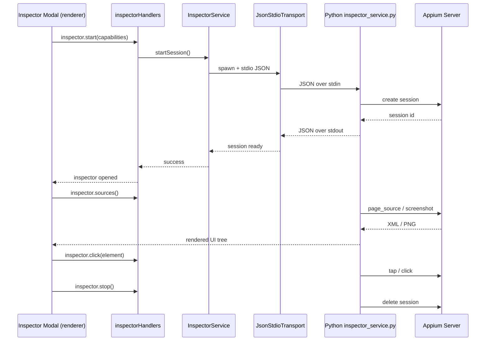

# 03 - Page Element Packaging

> **Applicable Version**: v0.1.4+ | **Target Audience**: Experienced test engineers

---

## Overview

The **Page Package** tab (`renderer/tabs/page-package/`) provides **App → Page → Element** three-level element locator management, supporting:

- App addition with automatic APK parsing (package name / version / launch Activity / multilingual labels)
- Page CRUD operations
- Unified maintenance of element locators (ID / XPath / Accessibility ID / Class, etc.)
- Appium Inspector element inspector integration (real-time UI tree inspection, one-click locator save)
- Search and statistics

---

## Workflow

```
Add app (parse APK) → Add page → Add element (or import from Inspector) → Reference in test cases
```

---

## Step 1: Add an App

### 1.1 Auto-fill via APK Parsing

Click **Add App** and select a local APK file:

1. `ApkParserService` invokes the `apk/` submodule to parse the APK:
   - `Aapt2Invoker.js` calls the `aapt2` command
   - `Aapt2OutputParser.js` parses the output (package name / version / Activity)
   - `LocaleLabelResolver.js` resolves multilingual app labels
2. The following fields auto-fill:
   - **App Name** (defaults to APK label, editable)
   - **Package Name** (e.g. `com.example.app`)
   - **Version** (e.g. `1.0.0`)
   - **Launch Activity** (e.g. `com.example.app.MainActivity`)

### 1.2 Manual Entry (Optional)

You may also manually fill in app info without APK parsing. However, APK parsing is recommended to avoid spelling errors.

---

## Step 2: Manage Pages

Click an app in the app list to enter its page list.

### 2.1 Add a Page

| Field | Description |
|-------|-------------|
| **Page Name** | Used for display and test case reference (e.g. `Login Page`) |
| **Page Description** | Page notes (optional) |

### 2.2 Page Operations

- **Edit** — Modify page info
- **Delete** — Delete the page (also deletes all its elements)

---

## Step 3: Manage Elements

Click a page in the page list to enter its element list.

### 3.1 Add an Element

| Field | Description |
|-------|-------------|
| **Element Name** | Used for test case reference (e.g. `Username Field`) |
| **Locator Strategy** | `id` / `xpath` / `accessibility id` / `class` / `android uiautomator` |
| **Locator Value** | The locator expression for the chosen strategy |
| **Element Description** | Element notes (optional) |

### 3.2 Element Operations

- **Edit** — Modify element info
- **Delete** — Delete the element

---

## Step 4: Inspect Elements with Appium Inspector (New)

XKAutoTester integrates Appium Inspector, letting you inspect the device UI tree in real time and save locators without leaving the app.

### 4.1 Launch Inspector

1. Connect an Android device in the **Android Connection** tab and start Appium
2. In the **Page Package** tab, select the target app and page
3. Click the **Inspector Element Check** button to open the Inspector modal (`components/inspector.js`, with 11 Mixins)

### 4.2 Inspector Communication Mechanism



### 4.3 Save Locators from Inspector

1. Click the target element in the Inspector UI tree
2. View its attributes (resource-id / xpath / content-desc, etc.)
3. Choose a suitable locator strategy and value
4. Click **Save as Element** — the element form auto-fills
5. Name it and save to the current page

> This avoids manual locator lookup and significantly boosts element maintenance efficiency.

---

## Step 5: Search & Statistics

### 5.1 Search

Enter keywords in the top search box to search:
- App name / package name
- Page name
- Element name / locator value

### 5.2 Statistics

The bottom of Page Package shows statistics:
- Total app count
- Total page count
- Total element count

---

## Data Persistence

All page package data persists to `config/page_package.json` (managed by `PagePackageService`, inherits `JsonFileCrudService`).

Example data structure:

```json
{
  "apps": [
    {
      "id": "app_xxx",
      "name": "Target App",
      "package": "com.example.app",
      "version": "1.0.0",
      "activity": "com.example.app.MainActivity",
      "pages": [
        {
          "id": "page_xxx",
          "name": "Login Page",
          "elements": [
            {
              "id": "elem_xxx",
              "name": "Username Field",
              "strategy": "id",
              "locator": "com.example.app:id/username"
            }
          ]
        }
      ]
    }
  ]
}
```

---

## Next Steps

- [02 - Test Case Management](02-test-case.md) (if not yet read)
- [04 - Test Execution & Reports](04-test-execution.md)
