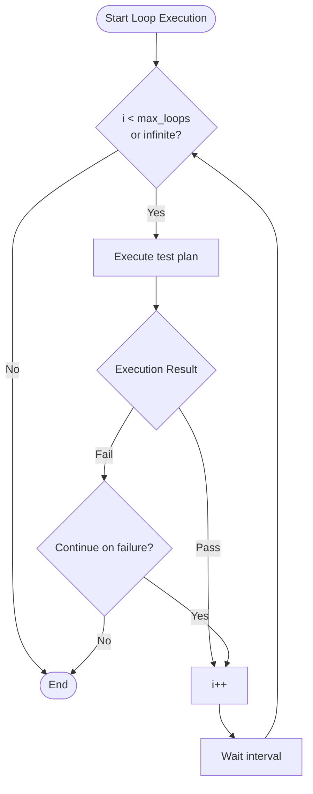

# 04 - Test Execution & Reports

> **Applicable Version**: v0.1.4+ | **Target Audience**: Experienced test engineers

---

## Overview

The **Test Execution** tab (`renderer/tabs/test-execution/`, with 16 Mixins) is the core entry point for test execution, supporting:

- Test plan management (create / edit / delete)
- Test file selection and test type filtering
- Test runs (one-shot / loop execution)
- Real-time console output
- Allure report viewing / cleanup
- DingTalk notification push

---

## Workflow

```
Select device → Create/Select test plan → Configure execution params → Run tests → View report
```

---

## Step 1: Select a Device

At the top of the **Test Execution** tab, select a connected Android device (cascade-select via the `device-cascade-select` component).

> The device must first be connected via ADB in the **Android Connection** tab. See [05 - Device Connection & Mirroring](05-device-connection.md).

---

## Step 2: Manage Test Plans

### 2.1 Create a Test Plan

Click **New Plan** and fill in:

| Field | Description |
|-------|-------------|
| **Plan Name** | Unique identifier (e.g. `regression_v1.0`) |
| **Test Files** | Select multiple `.py` files from `config/test_cases/` |
| **Test Type** | All / Android / Bluetooth (auto-detected based on case markers) |
| **Markers** | Pytest marker filter (e.g. `smoke`) |
| **Device** | Associated Android device |
| **BLE Mock Port** | Serial port number if BLE cases are included |

### 2.2 Test Type Auto-detection

`TestPlanService` auto-detects the type based on test case steps:
- Contains `start_ble_mock` / `stop_ble_mock` → Bluetooth case
- Other Android operations → Android case

### 2.3 Test Plan Operations

- **Edit** — Modify plan info
- **Delete** — Delete the plan (does not delete case files)
- **Duplicate** — Copy plan configuration

Test plans persist to `config/test_plans.json` (inherits `JsonFileCrudService`).

---

## Step 3: Configure Execution Parameters

### 3.1 One-shot Execution

The simplest execution mode: select a plan → click **Run**.

### 3.2 Loop Execution (New)

Loop execution allows a test plan to run multiple times, configurable:

| Parameter | Description |
|-----------|-------------|
| **Loop Count** | Total execution count (0 = infinite loop) |
| **Continue on Failure** | `true` (continue) / `false` (stop) |
| **Loop Interval** | Wait time between loops (seconds) |

Execution flow:



### 3.3 Scheduled Execution

Scheduled execution is managed via **Scheduled Plans**. See [06 - Scheduled Plans & Loop Execution](06-scheduled-plan.md).

---

## Step 4: Run Tests

After clicking **Run**:

1. `PythonTestService` invokes the Python backend via subprocess:
   ```bash
   python -m main --test-paths <paths> --markers <markers> --test-plan <name>
   # Env var XKAUTOTESTER_USER_DATA specifies the user data directory
   ```
2. Python side: `__main__.py` → `cli.py` → `pytest_runner.py` executes Pytest
3. The `pytest/` submodule collaborates:
   - `args_builder.py` builds pytest args
   - `path_resolver.py` resolves paths
   - `pytest_process.py` manages the pytest process
   - `stats_parser.py` parses statistics
   - `summary_formatter.py` formats the summary
4. Real-time output streams to the frontend console via IPC

### 4.1 Console Output

The console displays:
- Test start / end time
- Pass / fail / skip status for each case
- Failure stack traces
- Summary statistics (total / passed / failed / skipped / duration)

> Console output is displayed vertically without horizontal scrollbars. The **Clear Console** button removes existing output and restores the welcome message.

### 4.2 Stop Tests

Click **Stop** — `PythonTestService` terminates the subprocess.

---

## Step 5: View Allure Report

### 5.1 Generate Report

After tests finish, `AllureService` (aggregating the `allure/` submodule) auto-generates the report:
- `AllureCliInvoker.js` invokes the Allure CLI (npm package `allure ^3.9.0`) to generate static reports
- `AllureHttpServer.js` starts an HTTP service to host the report

### 5.2 View the Report

Click **View Report** — the Allure report opens in the default browser.

Report contents:
- Overview (pass rate / trend chart)
- Categories (failures / exceptions)
- Suites (grouped by test file)
- Timeline (execution duration)
- Behaviors (grouped by Epic / Feature / Story)

### 5.3 Report Management

- **Clear Reports** — Delete historical reports (`clearAllureReports`)
- **Stop Service** — Stop the Allure HTTP service (`stopAllureServer`)

---

## Step 6: DingTalk Notification (Optional)

After test execution, `NotificationService` auto-pushes DingTalk notifications (requires pre-configuration in **Settings → Notifications**).

Notification contents:
- Plan name
- Execution result (pass / fail)
- Summary statistics (total / passed / failed / skipped / duration)
- Report link (if Allure HTTP service is running)

Signing mechanism: HMAC-SHA256 (timestamp + secret) → Authorization header.

---

## Next Steps

- [05 - Device Connection & Mirroring](05-device-connection.md)
- [06 - Scheduled Plans & Loop Execution](06-scheduled-plan.md)
