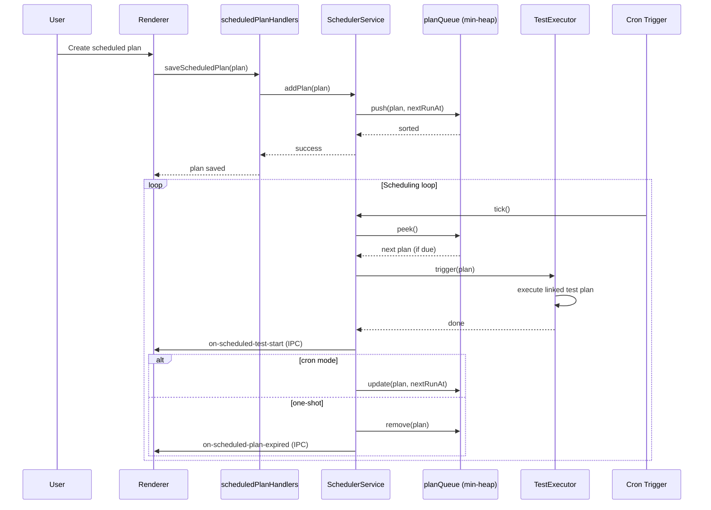

# 06 - Scheduled Plans & Loop Execution

> **Applicable Version**: v0.1.4+ | **Target Audience**: Experienced test engineers

---

## Overview

XKAutoTester provides scheduled execution via `SchedulerService` (aggregating the `scheduler/` submodule):

- Cron expression scheduled triggers
- One-shot scheduled execution
- Time conflict detection
- Smart scheduling strategies
- Integration with test plans / loop execution
- Auto-start tests on due time

---

## Workflow

```
Create scheduled plan → Configure cron/one-shot time → Link test plan → Scheduler monitors → Trigger on due → Auto-execute tests
```

---

## Step 1: Create a Scheduled Plan

### 1.1 Open Scheduled Plan Management

In the **Test Execution** tab, click **Scheduled Plans** to open the management modal.

### 1.2 Fill in Basic Info

| Field | Description |
|-------|-------------|
| **Plan Name** | Unique identifier (e.g. `nightly_regression`) |
| **Linked Test Plan** | Select from `config/test_plans.json` |
| **Execution Type** | `cron` (periodic) / `once` (one-shot) |

### 1.3 Configure Execution Time

#### Cron Mode

Supports standard 5-field cron expressions (based on `node-cron`):

| Field | Range | Description |
|-------|-------|-------------|
| Minute | 0-59 | `*` / `0` / `*/15` |
| Hour | 0-23 | `*` / `9` / `9-18` |
| Day | 1-31 | `*` / `1` / `*/2` |
| Month | 1-12 | `*` / `1` |
| Weekday | 0-6 (0=Sun) | `*` / `1-5` |

Examples:
- `0 9 * * 1-5` — Weekdays at 9:00
- `0 */2 * * *` — Every 2 hours
- `30 18 * * *` — Every day at 18:30

#### One-shot Mode

Use the `datetime-picker` component to select a specific date and time (e.g. `2026-08-01 14:00`).

---

## Step 2: Time Conflict Detection

`SchedulerService` performs conflict detection when saving a scheduled plan:

- Only one scheduled plan can trigger at any given moment
- Conflicts return an error; time must be adjusted

---

## Step 3: Scheduler Mechanism

### 3.1 Scheduler Architecture (Post-Refactor)

The `scheduler/` submodule is split into:

| Module | Responsibility |
|--------|----------------|
| `SchedulerService.js` | Scheduler service facade |
| `planQueue.js` | Min-heap priority queue (sorted by next trigger time) |
| `smartScheduler.js` | Smart scheduling strategies |
| `strategies.js` | Scheduling strategy implementations |
| `effects.js` | Side effects (IPC notifications, etc.) |
| `index.js` | Module exports |

### 3.2 Scheduling Flow



### 3.3 Smart Scheduling Strategies

`smartScheduler.js` + `strategies.js` provide multiple strategies:

- **FIFO** — First-in-first-out (default)
- **Priority** — By plan priority field
- **Resource-aware** — Wait for current test to finish before triggering the next

---

## Step 4: Loop Execution Integration

Tests triggered by scheduled plans can overlay loop execution parameters (see the loop execution section of [04 - Test Execution & Reports](04-test-execution.md)):

- Check **Enable Loop Execution** in the scheduled plan
- Configure loop count / continue on failure / loop interval
- Triggered executions run multiple times per loop parameters

---

## Step 5: Scheduled Plan Management

### 5.1 Edit

Click **Edit** in the scheduled plan list, modify, and save.

### 5.2 Delete

Click **Delete**; after confirmation, removed from `planQueue` and the record in `config/scheduled_plans.json` is deleted.

### 5.3 Enable / Disable

Supports temporarily disabling a scheduled plan (not deleted, just paused).

### 5.4 Status View

The scheduled plan list shows:
- Next trigger time
- Last execution time + result
- Status (pending / executing / expired / disabled)

---

## Step 6: Due Trigger Flow

When a scheduled plan is due:

1. `SchedulerService` pops the plan from `planQueue`
2. Notifies the renderer via IPC event `on-scheduled-test-start`
3. The renderer auto-switches to the **Test Execution** tab and links the test plan
4. Triggers test execution (equivalent to manually clicking **Run**)
5. On test completion, notifies via `on-scheduled-test-completed`
6. If one-shot, triggers `on-scheduled-plan-expired` and removes it
7. If cron, updates `nextRunAt` and re-enqueues

> The scheduler auto-stops on app exit; on next launch, it restores the queue from `config/scheduled_plans.json`.

---

## Data Persistence

Scheduled plan data persists to `config/scheduled_plans.json` (managed by `ScheduledPlanService`, inherits `JsonFileCrudService`).

Example data structure:

```json
{
  "plans": [
    {
      "id": "plan_xxx",
      "name": "nightly_regression",
      "testPlanId": "tp_yyy",
      "type": "cron",
      "cron": "0 9 * * 1-5",
      "enabled": true,
      "loopConfig": {
        "enabled": false,
        "count": 0,
        "continueOnFailure": true,
        "interval": 0
      },
      "lastRunAt": "2026-07-28T09:00:00",
      "nextRunAt": "2026-07-29T09:00:00"
    }
  ]
}
```

---

## Next Steps

- [04 - Test Execution & Reports](04-test-execution.md) (loop execution details)
- [07 - System Settings](07-settings.md)
