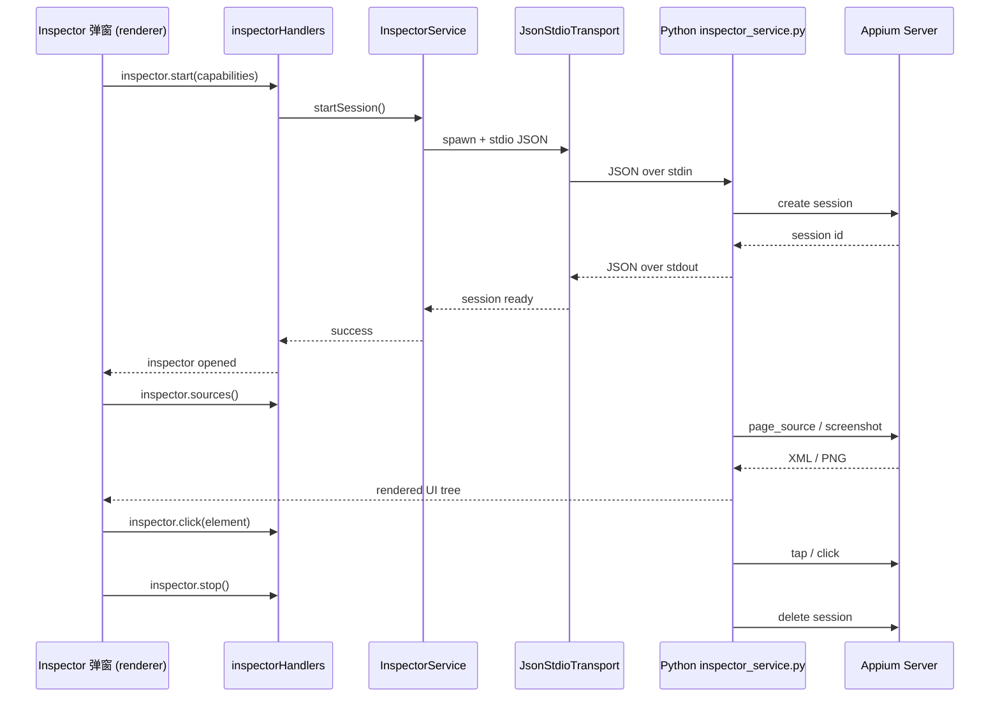

# 03 - 页面元素封装

> **适用版本**: v0.1.4+ | **目标读者**: 有自动化测试经验的测试工程师

---

## 概述

「页面封装」Tab（`renderer/tabs/page-package/`）提供**应用-页面-元素**三级元素定位器管理，支持：

- 应用的添加与 APK 自动解析（包名 / 版本 / 启动 Activity / 多语言标签）
- 页面的增删改查
- 元素定位器的统一维护（ID / XPath / Accessibility ID / Class 等）
- Appium Inspector 元素检查器联动（实时检查 UI 树，一键保存定位器）
- 搜索与统计

---

## 整体流程

```
添加应用（解析 APK）→ 添加页面 → 添加元素（或从 Inspector 导入）→ 在测试用例中引用
```

---

## 步骤 1：添加应用

### 1.1 通过 APK 解析自动填充

点击「添加应用」按钮，选择本地 APK 文件：

1. `ApkParserService` 调用 `apk/` 子模块解析 APK：
   - `Aapt2Invoker.js` 调用 `aapt2` 命令
   - `Aapt2OutputParser.js` 解析输出（包名 / 版本 / Activity）
   - `LocaleLabelResolver.js` 解析多语言应用标签
2. 自动填充以下字段：
   - **应用名称**（默认取 APK 标签，可修改）
   - **包名**（如 `com.example.app`）
   - **版本号**（如 `1.0.0`）
   - **启动 Activity**（如 `com.example.app.MainActivity`）

### 1.2 手动填写（可选）

也可不通过 APK，直接手动填写应用信息。但建议使用 APK 解析以避免拼写错误。

---

## 步骤 2：管理页面

在应用列表中点击某个应用，进入其页面列表。

### 2.1 添加页面

| 字段 | 说明 |
|------|------|
| **页面名称** | 用于显示与测试用例引用（如 `登录页`） |
| **页面描述** | 页面说明（可选） |

### 2.2 页面操作

- **编辑** — 修改页面信息
- **删除** — 删除页面（同时删除其下所有元素）

---

## 步骤 3：管理元素

在页面列表中点击某个页面，进入其元素列表。

### 3.1 添加元素

| 字段 | 说明 |
|------|------|
| **元素名称** | 用于测试用例引用（如 `用户名输入框`） |
| **定位策略** | `id` / `xpath` / `accessibility id` / `class` / `android uiautomator` |
| **定位值** | 对应策略的定位表达式 |
| **元素描述** | 元素说明（可选） |

### 3.2 元素操作

- **编辑** — 修改元素信息
- **删除** — 删除元素

---

## 步骤 4：使用 Appium Inspector 检查元素（新增）

XKAutoTester 集成了 Appium Inspector，可在不离开应用的情况下实时检查设备 UI 树并保存定位器。

### 4.1 启动 Inspector

1. 在「安卓连接」Tab 中连接 Android 设备并启动 Appium
2. 在「页面封装」Tab 选中目标应用和页面
3. 点击「Inspector 元素检查」按钮，弹出 Inspector 弹窗（`components/inspector.js`，含 11 个 Mixin）

### 4.2 Inspector 通信机制



### 4.3 从 Inspector 保存定位器

1. 在 Inspector UI 树中点击目标元素
2. 查看其属性（resource-id / xpath / content-desc 等）
3. 选择合适的定位策略与值
4. 点击「保存为元素」按钮，自动填入元素表单
5. 命名后保存到当前页面

> 这样可避免手动查找定位器，极大提升元素维护效率。

---

## 步骤 5：搜索与统计

### 5.1 搜索

在顶部搜索框输入关键词，可搜索：
- 应用名称 / 包名
- 页面名称
- 元素名称 / 定位值

### 5.2 统计

页面封装底部展示统计信息：
- 应用总数
- 页面总数
- 元素总数

---

## 数据持久化

所有页面封装数据持久化到 `config/page_package.json`（由 `PagePackageService` 管理，继承 `JsonFileCrudService`）。

数据结构示例：

```json
{
  "apps": [
    {
      "id": "app_xxx",
      "name": "被测应用",
      "package": "com.example.app",
      "version": "1.0.0",
      "activity": "com.example.app.MainActivity",
      "pages": [
        {
          "id": "page_xxx",
          "name": "登录页",
          "elements": [
            {
              "id": "elem_xxx",
              "name": "用户名输入框",
              "strategy": "id",
              "locator": "com.example.app:id/username"
            }
          ]
        }
      ]
    }
  ]
}
```

---

## 下一步

- [02 - 测试用例管理](02-test-case.md)（若尚未阅读）
- [04 - 测试执行与报告](04-test-execution.md)
