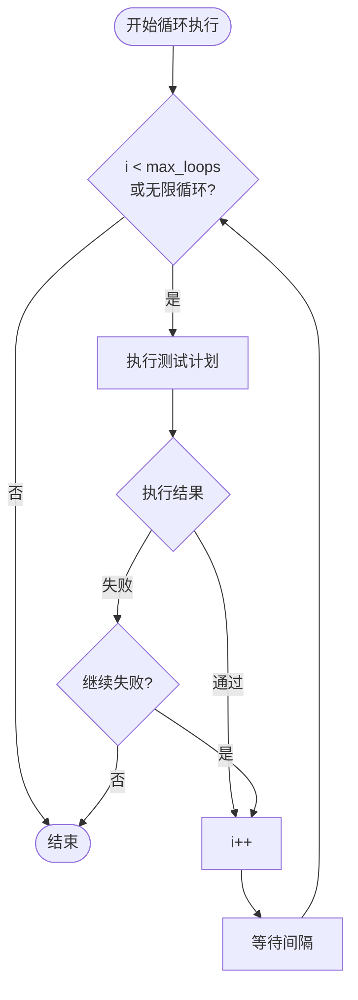

# 04 - 测试执行与报告

> **适用版本**: v0.1.4+ | **目标读者**: 有自动化测试经验的测试工程师

---

## 概述

「测试执行」Tab（`renderer/tabs/test-execution/`，含 16 个 Mixin）是测试执行的核心入口，支持：

- 测试计划管理（创建 / 编辑 / 删除）
- 测试文件选择与测试类型筛选
- 测试运行（一次性 / 循环执行）
- 实时控制台输出
- Allure 报告查看 / 清理
- 钉钉通知推送

---

## 整体流程

```
选择设备 → 创建/选择测试计划 → 配置执行参数 → 运行测试 → 查看报告
```

---

## 步骤 1：选择设备

在「测试执行」Tab 顶部选择已连接的 Android 设备（通过 `device-cascade-select` 组件级联选择）。

> 设备需先在「安卓连接」Tab 中通过 ADB 连接。详见 [05 - 设备连接与投屏](05-device-connection.md)。

---

## 步骤 2：管理测试计划

### 2.1 创建测试计划

点击「新建计划」按钮，填写：

| 字段 | 说明 |
|------|------|
| **计划名称** | 唯一标识（如 `regression_v1.0`） |
| **测试文件** | 从 `config/test_cases/` 中选择多个 `.py` 文件 |
| **测试类型** | 全部 / Android / 蓝牙（自动检测，基于用例标记） |
| **Markers** | Pytest 标记筛选（如 `smoke`） |
| **设备** | 关联的 Android 设备 |
| **蓝牙 Mock 端口** | 若含蓝牙用例，填写串口号 |

### 2.2 测试类型自动检测

`TestPlanService` 会根据测试用例中的步骤自动检测类型：
- 包含 `start_ble_mock` / `stop_ble_mock` → 蓝牙用例
- 其他 Android 操作 → Android 用例

### 2.3 测试计划操作

- **编辑** — 修改计划信息
- **删除** — 删除计划（不删除用例文件）
- **复制** — 复制计划配置

测试计划持久化到 `config/test_plans.json`（继承 `JsonFileCrudService`）。

---

## 步骤 3：配置执行参数

### 3.1 一次性执行

最简单的执行方式：选中计划 → 点击「运行」按钮。

### 3.2 循环执行（新增）

循环执行允许测试计划多次运行，可配置：

| 参数 | 说明 |
|------|------|
| **循环次数** | 总执行次数（0 = 无限循环） |
| **失败后是否继续** | `true`（继续）/ `false`（停止） |
| **循环间隔** | 每次循环之间的等待时间（秒） |

执行流程：



### 3.3 定时执行

定时执行通过「定时计划」管理，详见 [06 - 定时计划与循环执行](06-scheduled-plan.md)。

---

## 步骤 4：运行测试

点击「运行」按钮后：

1. `PythonTestService` 通过子进程调用 Python 后端：
   ```bash
   python -m main --test-paths <paths> --markers <markers> --test-plan <name>
   # 环境变量 XKAUTOTESTER_USER_DATA 指定用户数据目录
   ```
2. Python 端 `__main__.py` → `cli.py` → `pytest_runner.py` 执行 Pytest
3. `pytest/` 子模块协作：
   - `args_builder.py` 构建 pytest 参数
   - `path_resolver.py` 解析路径
   - `pytest_process.py` 管理 pytest 进程
   - `stats_parser.py` 解析统计
   - `summary_formatter.py` 格式化摘要
4. 实时输出通过 IPC 流式传输到前端控制台

### 4.1 控制台输出

控制台显示：
- 测试启动 / 结束时间
- 每个用例的 pass / fail / skip 状态
- 失败堆栈
- 摘要统计（总数 / 通过 / 失败 / 跳过 / 时长）

> 控制台输出垂直显示，无横向滚动条。「清空控制台」按钮会移除现有输出并恢复欢迎信息。

### 4.2 停止测试

点击「停止」按钮，`PythonTestService` 终止子进程。

---

## 步骤 5：查看 Allure 报告

### 5.1 生成报告

测试结束后，`AllureService`（聚合 `allure/` 子模块）自动生成报告：
- `AllureCliInvoker.js` 调用 Allure CLI（npm 包 `allure ^3.9.0`）生成静态报告
- `AllureHttpServer.js` 启动 HTTP 服务托管报告

### 5.2 查看报告

点击「查看报告」按钮，自动在默认浏览器打开 Allure 报告。

报告包含：
- Overview（总览：通过率 / 趋势图）
- Categories（分类：失败 / 异常）
- Suites（套件：按测试文件分组）
- Timeline（时间线：执行时长）
- Behaviors（行为：按 Epic / Feature / Story 分组）

### 5.3 报告管理

- **清理报告** — 删除历史报告（`clearAllureReports`）
- **停止服务** — 停止 Allure HTTP 服务（`stopAllureServer`）

---

## 步骤 6：钉钉通知（可选）

测试执行完成后，`NotificationService` 自动推送钉钉通知（需在「设置 → 通知」中预先配置）。

通知内容包含：
- 计划名称
- 执行结果（通过 / 失败）
- 统计摘要（总数 / 通过 / 失败 / 跳过 / 时长）
- 报告链接（如已启动 Allure HTTP 服务）

签名机制：HMAC-SHA256（timestamp + secret）→ Authorization header。

---

## 下一步

- [05 - 设备连接与投屏](05-device-connection.md)
- [06 - 定时计划与循环执行](06-scheduled-plan.md)
