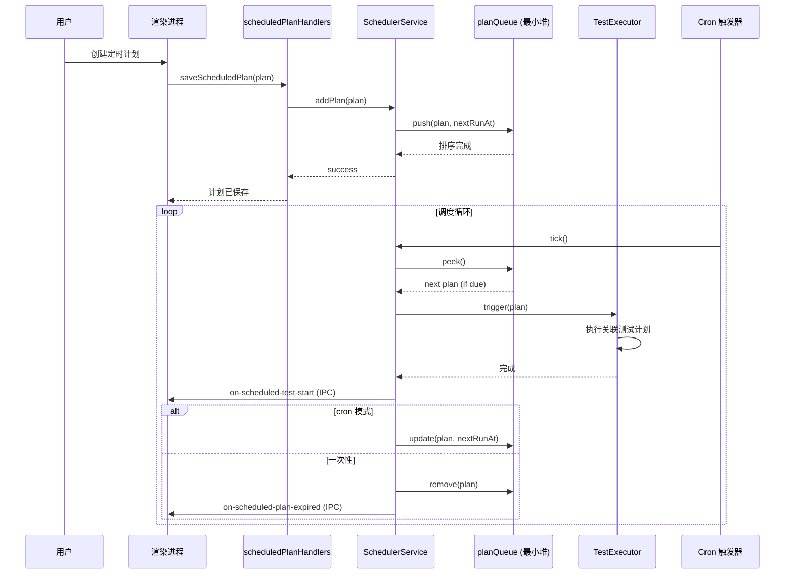

# 06 - 定时计划与循环执行

> **适用版本**: v0.1.4+ | **目标读者**: 有自动化测试经验的测试工程师

---

## 概述

XKAutoTester 通过 `SchedulerService`（聚合 `scheduler/` 子模块）提供定时执行能力：

- Cron 表达式定时触发
- 一次性定时执行
- 时间冲突检查
- 智能调度策略
- 与测试计划 / 循环执行联动
- 到期自动启动测试

---

## 整体流程

```
创建定时计划 → 配置 cron/一次性时间 → 关联测试计划 → 调度器监控 → 到期触发 → 自动执行测试
```

---

## 步骤 1：创建定时计划

### 1.1 进入定时计划管理

在「测试执行」Tab 中点击「定时计划」按钮，打开定时计划管理弹窗。

### 1.2 填写基本信息

| 字段 | 说明 |
|------|------|
| **计划名称** | 唯一标识（如 `nightly_regression`） |
| **关联测试计划** | 从 `config/test_plans.json` 中选择 |
| **执行类型** | `cron`（周期）/ `once`（一次性） |

### 1.3 配置执行时间

#### Cron 模式

支持标准 5 段 cron 表达式（基于 `node-cron`）：

| 字段 | 取值范围 | 说明 |
|------|---------|------|
| 分钟 | 0-59 | `*` / `0` / `*/15` |
| 小时 | 0-23 | `*` / `9` / `9-18` |
| 日期 | 1-31 | `*` / `1` / `*/2` |
| 月份 | 1-12 | `*` / `1` |
| 星期 | 0-6（0=周日） | `*` / `1-5` |

示例：
- `0 9 * * 1-5` — 工作日每天 9:00
- `0 */2 * * *` — 每 2 小时
- `30 18 * * *` — 每天 18:30

#### 一次性模式

通过 `datetime-picker` 组件选择具体的日期时间（如 `2026-08-01 14:00`）。

---

## 步骤 2：时间冲突检查

`SchedulerService` 在保存定时计划时执行冲突检查：

- 同一时刻只能有一个定时计划触发
- 冲突时返回错误，需调整时间

---

## 步骤 3：调度器机制

### 3.1 调度器架构（重构后）

`scheduler/` 子模块拆分为：

| 模块 | 职责 |
|------|------|
| `SchedulerService.js` | 调度服务门面 |
| `planQueue.js` | 最小堆优先队列（按下次触发时间排序） |
| `smartScheduler.js` | 智能调度策略 |
| `strategies.js` | 调度策略实现 |
| `effects.js` | 副作用（IPC 通知等） |
| `index.js` | 模块导出 |

### 3.2 调度流程



### 3.3 智能调度策略

`smartScheduler.js` + `strategies.js` 提供多种策略：

- **FIFO** — 先进先出（默认）
- **优先级** — 按 plan priority 字段
- **资源感知** — 等待当前测试完成再触发下一个

---

## 步骤 4：循环执行联动

定时计划触发的测试可叠加循环执行参数（详见 [04 - 测试执行与报告](04-test-execution.md) 的循环执行章节）：

- 在定时计划中勾选「启用循环执行」
- 配置循环次数 / 失败后是否继续 / 循环间隔
- 到期触发时按循环参数自动多次执行

---

## 步骤 5：定时计划管理

### 5.1 编辑

点击定时计划列表中的「编辑」按钮，修改后保存。

### 5.2 删除

点击「删除」按钮，确认后从 `planQueue` 移除并删除 `config/scheduled_plans.json` 中的记录。

### 5.3 启用 / 禁用

支持临时禁用定时计划（不删除，仅暂停触发）。

### 5.4 状态查看

定时计划列表显示：
- 下次触发时间
- 上次执行时间 + 结果
- 状态（待触发 / 执行中 / 已过期 / 已禁用）

---

## 步骤 6：到期触发流程

定时计划到期时：

1. `SchedulerService` 从 `planQueue` 弹出计划
2. 通过 IPC 事件 `on-scheduled-test-start` 通知渲染进程
3. 渲染进程自动切到「测试执行」Tab，关联测试计划
4. 触发测试执行（与手动点击「运行」按钮等价）
5. 测试完成后通过 `on-scheduled-test-completed` 通知
6. 若为一次性计划，触发 `on-scheduled-plan-expired` 并移除
7. 若为 cron 计划，更新 `nextRunAt` 重新入队

> 应用退出时调度器自动停止；下次启动时从 `config/scheduled_plans.json` 恢复队列。

---

## 数据持久化

定时计划数据持久化到 `config/scheduled_plans.json`（由 `ScheduledPlanService` 管理，继承 `JsonFileCrudService`）。

数据结构示例：

```json
{
  "plans": [
    {
      "id": "plan_xxx",
      "name": "nightly_regression",
      "testPlanId": "tp_yyy",
      "type": "cron",
      "cron": "0 9 * * 1-5",
      "enabled": true,
      "loopConfig": {
        "enabled": false,
        "count": 0,
        "continueOnFailure": true,
        "interval": 0
      },
      "lastRunAt": "2026-07-28T09:00:00",
      "nextRunAt": "2026-07-29T09:00:00"
    }
  ]
}
```

---

## 下一步

- [04 - 测试执行与报告](04-test-execution.md)（循环执行细节）
- [07 - 系统设置](07-settings.md)
